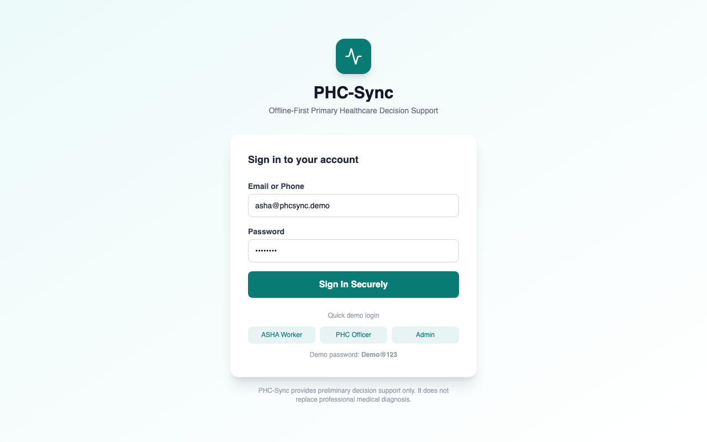

<div align="center">
  <h1>🩺 PHC-Sync</h1>
  <p><strong>An offline-first, AI-powered primary healthcare decision-support system for ASHA workers and PHCs.</strong></p>
  
  [](https://reactjs.org/)
  [](https://fastapi.tiangolo.com/)
  [](https://ollama.com/)
  [](https://vitejs.dev/)
  [](https://tailwindcss.com/)
</div>

<br />



## 📖 Overview

**PHC-Sync** is a resilient, offline-first web application designed specifically for rural and resource-constrained environments. It empowers ASHA (Accredited Social Health Activist) workers and Primary Health Centers (PHCs) to:
- Conduct preliminary risk assessments using transparent, rule-based clinical logic.
- Locate and request medicine stock across nearby PHCs dynamically.
- Utilize localized AI Copilots for language understanding and summarization, without losing core functionality if AI services drop.

> **Disclaimer:** This prototype is for demonstration and decision support only. It does **not** diagnose conditions, prescribe treatment, or replace professional medical advice.

---

## ✨ Features

- 🔒 **Role-Based Authentication:** Dedicated portals for ASHAs, PHC Officers, and Admins.
- 📶 **Offline-First Resilience:** Powered by IndexedDB and Dexie. Patient records created offline are stored locally and synced automatically when connectivity is restored.
- 🏥 **Real-Time Inventory Management:** Match medicine availability across current and nearby seeded PHCs.
- 📦 **Transfer Requests:** Seamless transfer-request creation for medical supplies, complete with officer approval/rejection workflows.
- 📊 **Responsive Dashboard:** Beautiful, responsive analytics populated dynamically from REST APIs.
- 🤖 **AI Copilot (Ollama):** Integrated local AI for natural language symptom extraction, forecasting explanations, and conversational support.

---

## 🛠️ Architecture

- **Frontend:** React + Vite, designed with a mobile-first philosophy. Uses TailwindCSS for styling and Dexie (IndexedDB) for robust offline storage.
- **Backend:** FastAPI REST APIs powered by SQLAlchemy models. 
- **Database:** Defaults to SQLite for immediate local setup, with full compatibility for PostgreSQL in production. 
- **Caching/State:** Redis is configured as an optional inventory cache service.

---

## 🚀 Getting Started

### Local Development (Without Docker)

**1. Start the Backend:**
```bash
cd backend
python3 -m venv .venv
source .venv/bin/activate
pip install -r requirements.txt
uvicorn app.main:app --reload --port 8000
```

**2. Start the Frontend:**
Open a new terminal window:
```bash
cd frontend
npm install
npm run dev
```

The application will be available at `http://localhost:5173`. The backend will automatically seed the database on the first start!

### 🐳 Docker Deployment

For a containerized deployment:
```bash
docker compose up --build
```

*(Note: Ensure you copy `backend/.env.example` to `backend/.env` and update secrets before production deployment.)*

---

## 🔑 Demo Credentials

Use the following accounts to explore the platform (Password for all: `Demo@123`):

- **ASHA Worker:** `asha@phcsync.demo`
- **PHC Officer:** `officer@phcsync.demo`
- **Administrator:** `admin@phcsync.demo`

---

## 🧠 Local AI Integration (Ollama)

PHC-Sync uses a local AI decision-support layer powered by **Ollama** (Llama 3.2). 

### Setup Instructions
1. Install [Ollama](https://ollama.com).
2. Start the Ollama engine.
3. Pull the required model:
   ```bash
   ollama pull llama3.2:3b
   ```
4. The backend connects automatically via `http://localhost:11434`.

*If Ollama is offline, PHC-Sync seamlessly falls back to its deterministic local clinical rule engines.*

---

## 🗺️ Interactive Demo Flow

1. **Sign in** as the ASHA Worker (`asha@phcsync.demo`).
2. **Register a patient** (e.g., a 65-year-old with Fever, Breathing difficulty, and SpO₂ 88). 
3. **Review Assessment:** Notice the HIGH risk level and urgent evaluation notice.
4. **Medicine Request:** Select a required medicine (e.g., *Salbutamol Inhaler*), check nearby PHC availability, and submit a transfer request.
5. **Approve Request:** Sign out, log back in as the PHC Officer (`officer@phcsync.demo`), and approve the pending transfer.
6. **Test Offline Mode:** Disable your network connection, add a patient, observe the "Pending Sync" status, reconnect, and watch it sync seamlessly!
